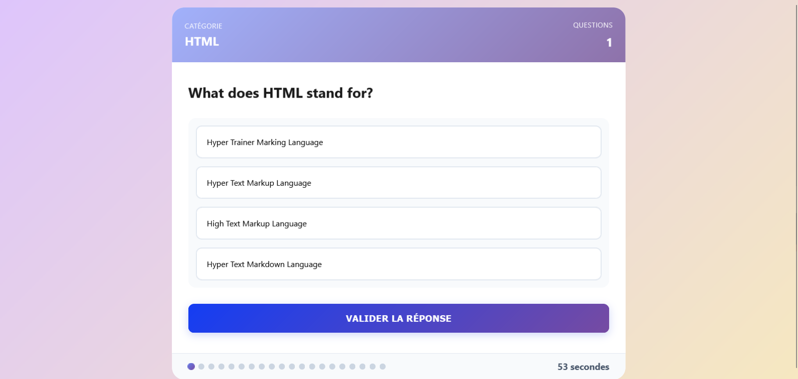

# 🧠 Quiz App

Une application de quiz interactive construite avec **HTML**, **CSS**, **JavaScript** et alimentée par un fichier `.json` contenant 20 questions.

---

## 📸 Aperçu



---

## 🚀 Fonctionnalités

- Affichage dynamique des questions depuis un fichier `.json`
- Interface responsive et moderne
- Chronomètre de **60 secondes** par question
- Si le temps est écoulé, passage automatique à la prochaine question
- La question non répondue ou incorrecte est comptée comme **fause**
- Affichage du **score final** à la fin du quiz

---

## 🛠 Technologies utilisées

- HTML5
- CSS3
- JavaScript (Vanilla)
- JSON (pour les données de questions)

---

## 📁 Structure des fichiers

```
smart-quiz/
├── Quiz-App.html        # Fichier principal HTML
├── css/
│   └── Quiz-App.css     # Styles personnalisés
├── js/
│   └── Quiz-App.js      # Logique du quiz avec gestion du timer
├── questions.json       # Données des 20 questions
└── image/
    └── screenshot.png  # Capture d'écran de l'application
```
